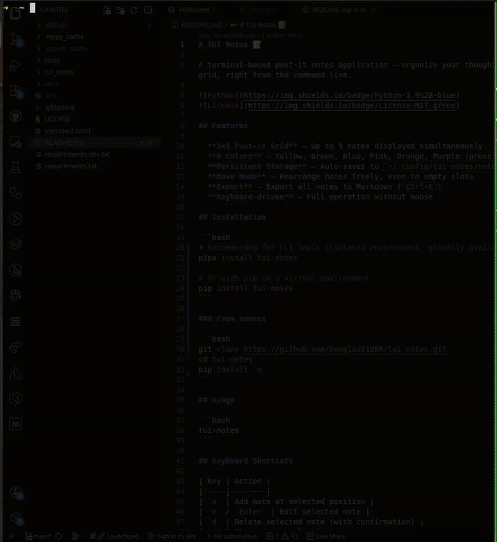

# TUI Notes 📝

A terminal-based post-it notes application — organize your thoughts in a 3×3 grid, right from the command line.




## Features

- **3×3 Post-it Grid** — Up to 9 notes displayed simultaneously
- **6 Colors** — Yellow, Green, Blue, Pink, Orange, Purple (press `c` to change)
- **Persistent Storage** — Auto-saves to `~/.config/tui-notes/notes.json`
- **Move Mode** — Rearrange notes freely, even to empty slots
- **Export** — Export all notes to Markdown (`Ctrl+E`)
- **Keyboard-driven** — Full operation without mouse

## Installation

```bash
# Recommended for CLI tools (isolated environment, globally available)
pipx install tui-notes

# Or with pip in a virtual environment
pip install tui-notes
```

### From source

```bash
git clone https://github.com/Douglas019BR/tui-notes.git
cd tui-notes
pip install -e .
```

## Usage

```bash
tui-notes
```

## Keyboard Shortcuts

| Key | Action |
|-----|--------|
| `a` | Add note at selected position |
| `e` / `Enter` | Edit selected note |
| `d` | Delete selected note (with confirmation) |
| `c` | Change note color |
| `m` | Enter Move mode (swap/reorder) |
| `←` `↑` `↓` `→` | Navigate between slots |
| `Ctrl+S` | Save notes manually |
| `Ctrl+R` | Reload notes from disk |
| `Ctrl+E` | Export to `~/tui-notes-export.md` |
| `?` | Show help screen |
| `Escape` | Cancel move mode |
| `q` | Quit |

## Data Storage

Notes are stored as JSON in the platform-specific config directory:

| Platform | Path |
|----------|------|
| Linux | `~/.config/tui-notes/notes.json` |
| macOS | `~/Library/Application Support/tui-notes/notes.json` |
| Windows | `%APPDATA%/tui-notes/notes.json` |

## Development

```bash
# Setup
python -m venv venv
source venv/bin/activate
pip install -e .
pip install -r requirements-dev.txt

# Run
python -m tui_notes

# Tests
pytest

# Linting
black tui_notes/ tests/
isort tui_notes/ tests/
pylint tui_notes/
```

## Requirements

- Python 3.9+
- Terminal with color support

## License

[MIT - LICENSE](LICENSE)
